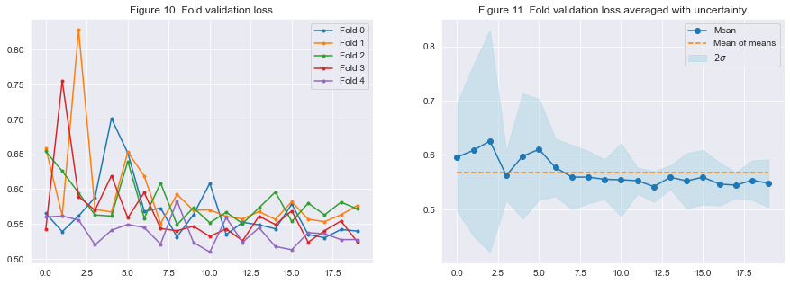

`Machine learning`, `Natural language processing`, `Exploratory data analysis`,  `Visualizations`, `Data cleaning`,  `Augmentation`, `Pytorch`, `Python` ,`Pandas`, `BERT`, `Model training and evaluation`, `Weights and biases`, `Kaggle`, `Regression`
<br>

# 	Project overview and foldable code

This project is based on the Kaggle competition [CommonLit Readability Prize](https://www.kaggle.com/c/commonlitreadabilityprize/overview). The goal of the competition is pretty straightforward: Predict readability scores from text excerpts. I cannot provide the dataset directly, but it can be downloaded [here](https://www.kaggle.com/c/commonlitreadabilityprize/data).
<br>

## Project overview


<br>

## Project overview - In details

The project (i.e. this notebook) is separated into 4 sections:

      1.) Data exploration and preprocessing:
      General overview, data cleaning, stratified folds
      
      2.) Training preparation:
      BERT model & tokenizer, Augmentation, DataLoader, Optimizer, LR-scheduler, loss
      
      3.) Training with Weights and Biases:
      Training and evaluation of the BERT model
      
      4.) Final evaluation:
      Result analysis and kaggle submission

## Foldable code
All code in this notebook is foldable. This was done in an attempt to increase readability and avoid overcluttered sections.  Example:

<details>
<summary><b><u>PRESS THIS TO SEE THE CODE</u></b></summary>

```python
print("Hello World!")
```

</details>

<br>


# Imports
<details>
<summary><b><u>PRESS THIS TO SEE THE CODE</u></b></summary>

```python
# Torch
import wandb
import torch
import torch.nn as nn
import transformers
from transformers import BertForSequenceClassification, BertTokenizer, BertConfig

# All around
import helpers as H
import matplotlib.pyplot as plt
import seaborn as sns; sns.set_style("darkgrid")
from scipy.stats.stats import pearsonr
import sklearn.model_selection
from tqdm.notebook import tqdm
import pandas as pd
import numpy as np
import warnings
import random
import gc
import os   

# Silience FutureWarning from seaborn.distplot()
warnings.simplefilter(action='ignore', category=FutureWarning)

# Huggingface's warnings are way to verbose for this. 
transformers.logging.set_verbosity_error()
```

</details>

<br>

# 1.) Data exploration, cleaning and preprocessing

## 1.2.) First look
There are 3 interesting variables in the dataset `excerpt`, `target` and `standard_error`. `excerpt` contains the text which should be used to predict readability scores i.e. `target` and the `standard_error` tell us how much disagreement there were between the experts that annotated the `excerpt`.
<br>
<br>
There are some differences between the `train.csv` and the `test.csv` dataset. Namely that `train.csv` contains two extra columns of data: `target` and `standard_error`. `target` is obviously not present in the `test.csv` since it's the thing we try to predict. `standard_error` is however not supposed to be predicted, which means that `standard_error` is available during training and not during inference which ought to be kept in mind when designing the model. 
<br>
<br>
Note that the real `test.csv` file contains much more than the 7 samples we can see here, but these remaining samples are kept hidden until submission.

<br>


<details>
<summary><b><u>PRESS THIS TO SEE THE CODE</u></b></summary>

```python
df_train = pd.read_csv("./data/train.csv")
print(f"Train samples: {len(df_train)}")
display(df_train.head())

df_test = pd.read_csv("./data/test.csv")
print(f"Test samples: {len(df_test)}")
df_test
```
</details>

```python
Train samples: 2834
```

<div>
<table border="1" class="dataframe">
  <thead>
    <tr style="text-align: middle;">
      <th></th>
      <th>id</th>
      <th>url_legal</th>
      <th>license</th>
      <th>excerpt</th>
      <th>target</th>
      <th>standard_error</th>
    </tr>
  </thead>
  <tbody>
    <tr>
      <th>0</th>
      <td>c12129c31</td>
      <td>NaN</td>
      <td>NaN</td>
      <td>When the young people returned to the ballroom...</td>
      <td>-0.340259</td>
      <td>0.464009</td>
    </tr>
    <tr>
      <th>1</th>
      <td>85aa80a4c</td>
      <td>NaN</td>
      <td>NaN</td>
      <td>All through dinner time, Mrs. Fayre was somewh...</td>
      <td>-0.315372</td>
      <td>0.480805</td>
    </tr>
    <tr>
      <th>2</th>
      <td>b69ac6792</td>
      <td>NaN</td>
      <td>NaN</td>
      <td>As Roger had predicted, the snow departed as q...</td>
      <td>-0.580118</td>
      <td>0.476676</td>
    </tr>
    <tr>
      <th>3</th>
      <td>dd1000b26</td>
      <td>NaN</td>
      <td>NaN</td>
      <td>And outside before the palace a great garden w...</td>
      <td>-1.054013</td>
      <td>0.450007</td>
    </tr>
    <tr>
      <th>4</th>
      <td>37c1b32fb</td>
      <td>NaN</td>
      <td>NaN</td>
      <td>Once upon a time there were Three Bears who li...</td>
      <td>0.247197</td>
      <td>0.510845</td>
    </tr>
  </tbody>
</table>
</div>

```python
Test samples: 7
```

<div>
<table border="1" class="dataframe">
  <thead>
    <tr style="text-align: middle;">
      <th></th>
      <th>id</th>
      <th>url_legal</th>
      <th>license</th>
      <th>excerpt</th>
    </tr>
  </thead>
  <tbody>
    <tr>
      <th>0</th>
      <td>c0f722661</td>
      <td>NaN</td>
      <td>NaN</td>
      <td>My hope lay in Jack's promise that he would ke...</td>
    </tr>
    <tr>
      <th>1</th>
      <td>f0953f0a5</td>
      <td>NaN</td>
      <td>NaN</td>
      <td>Dotty continued to go to Mrs. Gray's every nig...</td>
    </tr>
    <tr>
      <th>2</th>
      <td>0df072751</td>
      <td>NaN</td>
      <td>NaN</td>
      <td>It was a bright and cheerful scene that greete...</td>
    </tr>
    <tr>
      <th>3</th>
      <td>04caf4e0c</td>
      <td>https://en.wikipedia.org/wiki/Cell_division</td>
      <td>CC BY-SA 3.0</td>
      <td>Cell division is the process by which a parent...</td>
    </tr>
    <tr>
      <th>4</th>
      <td>0e63f8bea</td>
      <td>https://en.wikipedia.org/wiki/Debugging</td>
      <td>CC BY-SA 3.0</td>
      <td>Debugging is the process of finding and resolv...</td>
    </tr>
    <tr>
      <th>5</th>
      <td>12537fe78</td>
      <td>NaN</td>
      <td>NaN</td>
      <td>To explain transitivity, let us look first at ...</td>
    </tr>
    <tr>
      <th>6</th>
      <td>965e592c0</td>
      <td>https://www.africanstorybook.org/#</td>
      <td>CC BY 4.0</td>
      <td>Milka and John are playing in the garden. Her ...</td>
    </tr>
  </tbody>
</table>
</div>


<br>


## 1.3.) Remove the columns _url_legal_ and _license_
It's hard to see how the two columns `url_legal` and `license` can add much predictive power to the model (even if they weren't missing most of their values, which they are). Furthermore, the official description of the data points out that the real `test.csv` doesn't contain any values for `url_legal` or `license`. Because of this, I think removing them right away is the smartest thing to do. I might try and see if they can benefit the model in any way later on, but gonna keep it simple for now.

<br>

<details>
<summary><b><u>PRESS THIS TO SEE THE CODE</u></b></summary>

```python
df_train.info()
df_train = df_train.drop(columns=["url_legal", "license"])
df_test = df_test.drop(columns=["url_legal", "license"])
```

</details>

    <class 'pandas.core.frame.DataFrame'>
    RangeIndex: 2834 entries, 0 to 2833
    Data columns (total 6 columns):
     #   Column          Non-Null Count  Dtype  
    ---  ------          --------------  -----  
     0   id              2834 non-null   object 
     1   url_legal       830 non-null    object 
     2   license         830 non-null    object 
     3   excerpt         2834 non-null   object 
     4   target          2834 non-null   float64
     5   standard_error  2834 non-null   float64
    dtypes: float64(2), object(4)
    memory usage: 133.0+ KB

<br>

## 1.4) Closer look at '_target_'

`target` is particularly interesting because it's the variable we try to predict. `target` is essentially a readability score that indicates how easy or how hard any given text is. That is, a low value indicates a text is hard to read and a high value suggests that a text is easy to read.
<br>
<br>
Figure 1. (left plot) suggests that `target` roughly follows a normal distribution with parameters $\mathcal{N}(-1, 1)$. The range of `target` spans from approx. -3.7 to 1.7, which is depicted in Figure 2. (right plot)
<br>
<br>
The range seems very arbitrary and I couldn't find any further explanation as to why this scale was chosen. I guess the experts that have annotated the `excerpt` texts used some sort of standardized scale, but I'm not sure. For the sake of interoperability, it would be nice to normalize (min-max) the text such that 0 would encode "easiest text" and 1 would encode "hardest text". But this is not really an option because the test data needs to be predicted on the same scale as the training data (you could of course map back-and-forth between the two, but it seems like too much of a hassle).
<br>
<br>

<details>
<summary><b><u>PRESS THIS TO SEE THE CODE</u></b></summary>

```python
# Key figures, rounded
min_value = round(df_train["target"].min(), 3)
max_value = round(df_train["target"].max(), 3)
mean = round(df_train["target"].mean(), 3)
std = round(df_train["target"].std(), 3)

fig, (ax1, ax2) = plt.subplots(1,2, figsize=(20,5))
plt.suptitle("Target")

# 1.) Left
ax1.set_title("Figure 1. Histogram with KDE")
sns.distplot(df_train["target"], bins=15, ax=ax1)
ax1.plot([mean, mean], [0, 0.4], '--', linewidth=3)
ax1.legend(["KDE", "Mean", "Hist, 15 bins"])

# 2.) right
ax2.set_title("Figure 2. Box plot")
sns.boxplot(df_train["target"], ax=ax2)
ax2.text(min_value-0.25, -0.25, f'Min: {min_value}', fontsize=12)
ax2.text(max_value-0.4, -0.25, f'Max: {max_value}', fontsize=12)
ax2.text(-1.85, -0.43, f'Mean: {mean}  |  STD: {std}', fontsize=12);
```

</details>


<br>

## 1.5) Excerpts

`excerpt` contains the texts which `target` describes the readability of. 3 examples have been printed below ranging from easiest to hardest. It's a somewhat subjective evaluation, but I think the scoring system seems reasonable, at least from these 3 examples. It's especially clear that the easiest excerpt is far more accessible than the hardest one which seems much more advanced.
<br>
<br>

<details>
<summary><b><u>PRESS THIS TO SEE THE CODE</u></b></summary>

```python
print("Easiest text\n" + "_"*128)
print(df_train["excerpt"].iloc[df_train["target"].argmax()][0:200])

print("\nAverage text\n" + "_"*128)
# Sort the dataframe and select the middlemost text.
print(df_train["excerpt"].sort_values().
      reset_index(drop=True).iloc[ len(df_train)//2 ][0:200])

print("\nHardest text\n" + "_"*128)
print(df_train["excerpt"].iloc[df_train["target"].argmin()][0:200])
```

</details>

    Easiest text
    ________________________________________________________________________________________________________________________________
    When you think of dinosaurs and where they lived, what do you picture? Do you see hot, steamy swamps, thick jungles, or sunny plains? Dinosaurs lived in those places, yes. But did you know that some d
    
    Average text
    ________________________________________________________________________________________________________________________________
    Nicolas and Natacha, his son and daughter, often found their father and mother in anxious consultation, talking in low tones of the sale of their Moscow house or of their property in the neighborhood.
    
    Hardest text
    ________________________________________________________________________________________________________________________________
    The commutator is peculiar, consisting of only three segments of a copper ring, while in the simplest of other continuous current generators several times that number exist, and frequently 120! segmen


### 1.5.1) Average word length and number of characters
I calculated some key figures and made some visualization of character count and average word length in each excerpt to get a better idea about how they relate to `target`. 
<br>
<br>
The number of characters in each excerpt seems to follow a somewhat skewed normal with an approx. mean of 1000 (figure 3). The same goes for the average word length which is centered around \~ 4.5 characters (figure 4).
<br>
<br>
The point cloud and regression line in figure 6. show that there's a clear negative correlation between average word length and readability, which seems very reasonable (i.e. in general, harder texts use longer words and easier texts use shorter ones).
<br>
<br>
The correlation seen in figure 5. is however not as intuitive. It's not immediately obvious why easier texts would be shorter than harder ones. This is especially true since we are dealing with excerpts and not full-length texts, so I guess this is a bias introduced by the people making the dataset more than a real fact about the data.
<br>
<br>

<details>
<summary><b><u>PRESS THIS TO SEE THE CODE</u></b></summary>

```python
# Key figures
character_count = df_train.apply(lambda row: len(row["excerpt"]), axis=1)
avg_word_length = df_train.apply(
    lambda row: np.mean([len(w) for w in row["excerpt"].split()]), axis=1
)
character_mean, avg_word_mean = [
    round(mean, 3) for mean in [character_count.mean(), avg_word_length.mean()]
]
word_target_corr, _ = pearsonr(avg_word_length, df_train["target"])
char_target_corr, _ = pearsonr(character_count, df_train["target"])

# Plots
fig, axis = plt.subplots(2,2, figsize=(20,15))
plt.suptitle("Excerpt")

## 1.) Left top
axis[0,0].set_title("Figure 3. Character count")
sns.distplot(character_count, bins=15, ax=axis[0, 0])
axis[0, 0].plot([character_mean, character_mean],[0, 0.003], '--',linewidth=3)
axis[0, 0].legend(["KDE", f"Mean: {character_mean}", "Hist, 15 bins"])
axis[0, 0].set_xlabel("Character length")

## 2.) Right top
axis[0, 1].set_title("Figure 4. Average word length")
sns.distplot(avg_word_length, bins=15, ax=axis[0, 1])
axis[0, 1].plot([avg_word_mean, avg_word_mean], [0, 1], '--', linewidth=3)
axis[0, 1].legend(["KDE", f"Mean: {avg_word_mean}", "Hist, 15 bins"])
axis[0, 1].set_xlabel("Average word length")

## 3.) Left bottom
axis[1,0].set_title("Figure 5. Scatter plot: Character length VS target")
sns.regplot(x=character_count, y=df_train["target"], marker=".", ax=axis[1,0],
            scatter_kws={"color": H.colors_hex.blue}, 
            line_kws={"color": H.colors_hex.orange}
           )
axis[1, 0].legend(["Character length", f"Correlation: {char_target_corr:.3f}"])
axis[1, 0].set_xlabel("Character length")

## 4.) Right bottom
axis[1,1].set_title("Figure 6. Scatter plot: Average word length VS target")
sns.regplot(x=avg_word_length, y=df_train["target"], marker=".", ax=axis[1,1],
            scatter_kws={"color": H.colors_hex.blue}, 
            line_kws={"color": H.colors_hex.orange}
           )
axis[1, 1].legend(["Avg. word length", f"Correlation: {word_target_corr:.3f}"])
axis[1, 1].set_xlabel("Average word length");
```

</details>


## 1.6) Closer look at  '_standard_error_'
The `excerpt` and corresponding `target` has been assessed by multiple experts and the `standard_error` is calculated on the differences in opinion between these. As mentioned, this attribute is only available in the training dataset, but is worth pointing out again.
<br>
<br>
Quite a lot can be said about the pair plot seen in figure 7. Most interestingly among these are the horizontal/vertical 'smiley' shape seen in the right uppermost plot and left lowermost plot. This shape suggests that the experts tend to disagree more on `excerpt` located in the tails of the `target`-distribution (i.e. the very hard and the very easy texts) which seems very reasonable. Secondly, The average STD lay somewhere between 0.45 and 0.5 which is a pretty significant STD for a variable (i.e. `target`) ranging from -3.7 to 1.7. With that said, the relatively modest spread in the STD itself is pretty impressive, given how challenging it most be to objectively measure readability.
<br>
<br>

<details>
<summary><b><u>PRESS THIS TO SEE THE CODE</u></b></summary>

```python
plot = sns.pairplot(
    df_train[df_train != 0].loc[:, ["standard_error", "target"]], 
    diag_kind="hist", height=4, aspect=1.5
)
plot.fig.suptitle("Figure 7. Target and standard deviation", y=1.05)
```

</details>


## 1.7) Seperating the data into folds

It's always a good idea to perform some sort of cross-validation (CV) whenever possible, because this often provides a much accurate estimate of performance. But in order to do CV, we need to separate the data into folds. It's my understanding that these folds should always be stratified if at all possible to avoid any imbalance issues within each fold. How to perform these stratified splits is however not immediately obvious, because the `target` is a continuous variable. One possible option (and the one I'm gonna use) is to bucket the data into a predefined number of bins and calculate the stratified folds from this. 
<br>
<br>
I only used 5 folds to keep the required computational resources at a reasonable level. The number of bins to bucket the data into was chosen (somewhat arbitrarily) to be 15.
<br>
<br>

<details>
<summary><b><u>PRESS THIS TO SEE THE CODE</u></b></summary>

```python
# Bucket the data
num_bins = 15
count, division = np.histogram(df_train["target"], bins=num_bins)
df_train["bucket_label"] = pd.cut( df_train["target"], 
    bins=num_bins, labels=False)

# Assign stratified folds
kf = sklearn.model_selection.StratifiedKFold(
    n_splits=5, random_state=12, shuffle=True)
df_train["fold"] = None
iterator = enumerate(kf.split(X=df_train, y=df_train["bucket_label"].values))
for i, (train_idx, valid_idx) in iterator:
    df_train.loc[valid_idx, 'fold'] = i

# Plot
buckets_density = df_train.groupby("bucket_label").
    count()["target"]/len(df_train)
plt.figure(figsize=(10,7))
plt.bar(range(len(buckets_density)), buckets_density)
plt.title("Figure 8. Buckets used to make stratified folds")
plt.xlabel("Bucket label")
plt.ylabel("Density");
```

</details>


<br>

# 2.) Training preparation

Section overview: 

* BERT tokenizer 
* Dataset and DataLoader
* BERT model
* Loss function
* Optimizer
* Learning rate scheduler. 
* Data augmentation

All hyperparameters and alike will be controlled from the class `Config` (see code below)
<br>

<details>
<summary><b><u>PRESS THIS TO SEE THE CODE</u></b></summary>

```python
class Config:
    # Controls
    debug = False
    use_wandb = True if not debug else False
    wandb_api_key = "" # Enter your own weights and biases API key here.
    device = torch.device("cuda" if torch.cuda.is_available() else "cpu")
    workers = 0 # Windows dosen't handle workers > 0 very well.
    epochs_trained = 0

    # BERT
    bert_name = "bert-base-uncased"
    tokenizer = BertTokenizer
    model = BertForSequenceClassification
    bert_config = BertConfig
    dropout = nn.Dropout(0.1)
    max_len = 271
    
    # Hypers
    batch_size = 32
    fold = "all"
    epochs = 20 if not debug else 2
    criterion = "RMSELoss"
    learning_rate = 1e-4
    optimizer_hyper = dict(lr = learning_rate)
    optimizer = transformers.AdamW
    scheduler_hyper = dict(lr_lambda=lambda epoch: 0.95 ** epoch)
    scheduler = torch.optim.lr_scheduler.LambdaLR

    # Seed everything
    seed = 12
    torch.backends.cudnn.deterministic = True # Can increase run time
    random.seed(seed)
    os.environ['PYTHONHASHSEED'] = str(seed)
    np.random.seed(seed)
    torch.manual_seed(seed)
    torch.cuda.manual_seed(seed)
    
    # Everything in this dict will be logged on weights and biases
    to_log = dict(
        fold = fold,
        seed = seed,
        debug = debug,
        device = device,
        epochs = epochs,
        workers = workers,
        batch_size = batch_size,
        criterion = criterion,
        optimizer = (optimizer, optimizer_hyper),
        scheduler = (scheduler, scheduler_hyper),
        bert_architecture = (
            bert_name, model, tokenizer, dropout, f"max_token_len: {max_len}"
        ),
        dataset="https://www.kaggle.com/c/commonlitreadabilityprize/data",
        notes="Simple baseline" 
    )

C = Config()

if C.use_wandb and C.wandb_api_key:
    wandb.login(key = C.wandb_api_key)
    wandb.init(project="portfolio", config=C.to_log)
```

</details>

<br>

## 2.1.) Tokenizer
Huggingface's BERT tokenizer has this awesome function `encode_plus` which does most of the heavy lifting for us, it only really requires us to decide what `max_length` should be. I believe there's a hard upper limit of 512, but it seems super wasteful to use this value if it's not necessary (all sentences need to be zero-padded to this length).
<br>
<br>
The histogram shown in figure 9 illustrates the token length distribution of all the `excerpt` values. The longest one is 330, but the vast majority of excerpts lay way below that. I think it would be reasonable to set a man token length such that 95\% of the excerpt remains non-truncated. This is at a length of 271 as (see orange figure 9).
<br>
<br>
I printed a single example with the tokenization of the string `Hello World!`
<br>
<br>

<details>
<summary><b><u>PRESS THIS TO SEE THE CODE</u></b></summary>

```python
tokenizer = C.tokenizer.from_pretrained(C.bert_name, do_lower_case=True)

#Max token length calculation and plot
excerpt_token_len = df_train.apply(
    lambda row: len(tokenizer.tokenize(row.excerpt)), axis=1
)

index_95 = int(len(df_train) * 0.95)
threshold_token_length_95 = sorted(excerpt_token_len)[ index_95 ]

plt.figure(figsize=(10,7))
sns.histplot(excerpt_token_len, bins=15)
plt.plot([threshold_token_length_95, threshold_token_length_95], [0, 450], 
         '--', linewidth=3, color=H.colors_hex.orange
        )
plt.title("Figure 9. Number of tokens in each excerpt")
plt.xlabel("Number of tokens")
plt.ylabel("Count");
plt.legend(
    [f"95% token cutoff: {threshold_token_length_95}", "Number of tokens"]
)


# Helper function to aid tokenize in the Dataset class 
def process_text(excerpt:str):
    encoded_dict = tokenizer.encode_plus(
                    excerpt, 
                    padding="max_length", 
                    truncation = True,
                    add_special_tokens = True,     # Add '[CLS]' and '[SEP]'
                    max_length = C.max_len,        # Pad/truncate text to fit                       
                    return_attention_mask = True,  # Make attension masks.
                    return_tensors = 'pt',         # Pytorch tensors format.
               )
    
    token_ids = encoded_dict['input_ids'].to(C.device)
    attention_masks = encoded_dict['attention_mask'].to(C.device)
    return token_ids, attention_masks


# Example
token_ids, attention_masks = process_text("Hello World!")
print("First 10 tokens 'Hello World!': ", token_ids[0,:10].tolist())
print("First 10 masks of 'Hello World!': ", attention_masks[0,:10].tolist())
```

</details>

    First 10 tokens 'Hello World!':  [101, 7592, 2088, 999, 102, 0, 0, 0, 0, 0]
    First 10 masks of 'Hello World!':  [1, 1, 1, 1, 1, 0, 0, 0, 0, 0]


## 2.2.) Datasets and DataLoaders
The custom `Dataset` class returns token indices, masks, and `target` values. This class will be used in the `get_dataloader(fold:int)` function which returns a `torch.utils.data.DataLoader` for both training and validation. All this shenanigans are just to make it easier to train the model and perform cross-validation, and as such, is not strictly necessary but just convenient.<br>

<details>
<summary><b><u>PRESS THIS TO SEE THE CODE</u></b></summary>

```python
class Dataset:
    def __init__(self, data):
        self.data = data.reset_index(drop=True)
        self.targets = torch.tensor(data["target"].values).float().to(C.device)
        
    def __len__(self):
        return len(self.targets)
    
    def __getitem__(self, i):
        sentence = self.data["excerpt"][i]
        token_ids, masks = process_text(sentence)
        return token_ids.squeeze(1)[0], masks.squeeze(1)[0], self.targets[i]

def get_dataloader(fold):
    df = df_train
    # Folds
    if C.debug:
        import sklearn.model_selection
        train_idx, valid_idx = sklearn.model_selection.train_test_split(
            df.index, test_size=0.2)
    else:    
        train_idx = df[df["fold"] != fold].index
        valid_idx = df[df["fold"] == fold].index

    # Dataloaders
    train_dataset = Dataset(df.loc[train_idx, :])
    train_dl = torch.utils.data.DataLoader(
        train_dataset, 
        shuffle=True, 
        num_workers=C.workers, 
        batch_size=C.batch_size
    )

    valid_dataset = Dataset(df.loc[valid_idx, :])
    valid_dl = torch.utils.data.DataLoader(
        valid_dataset, 
        shuffle=False, 
        num_workers=C.workers, 
        batch_size=C.batch_size
    )
    
    return train_dl, valid_dl
```

</details>

<br>

## 2.3.) BERT Model
BERT and BERT-derived models come in many varieties and can be utilized for different things. But to keep it as simple as possible, I will just use a single of Huggingface's smallest uncased models `bert-base-uncased`. I will however mention that I got better results from an ensemble of different models (e.g. RoBERTa). 
<br>
<br>
I made a simple sanity check, where a single batch was based through the model while monitoring the amount of VRAM used (to catch potential memory leaks).
<br>
<br>

<details>
<summary><b><u>PRESS THIS TO SEE THE CODE</u></b></summary>

```python
class Model(nn.Module):
    def __init__(self):
        super().__init__()
        bert_config = C.bert_config.from_pretrained(C.bert_name)
        bert_config.num_labels = 1
        bert_config.hidden_dropout_prob = C.dropout.p
        self.bert = C.model.from_pretrained(C.bert_name, config=bert_config)
    
    def forward(self, ids, masks):
        x = self.bert(ids, attention_mask=masks, return_dict=False)
        return x[0].squeeze(1)

#Sanity and VRAM leak check 
print(H.get_gpu_memory_info())
model = Model().to(C.device)
train_dl, _ = get_dataloader(0)

with torch.no_grad():
    model.eval()
    b_ids, b_masks, b_targets = next(iter(train_dl))
    print("model out: ", model(b_ids, b_masks))
    
del model, train_dl, b_ids, b_masks, b_targets
print(H.get_gpu_memory_info())
```

</details>


    {'GPU': 'Tesla P100-PCIE-16GB', 'free': 15427, 'used': 853, 'total': 16280}
    model out:  tensor([ 0.3732,  0.2900,  0.4235,  0.2211,  0.3187,  0.3886,  0.1909,  0.3000,
             0.2452,  0.0895,  0.1893,  0.3944,  0.3697,  0.4118,  0.4274,  0.5041,
             0.2507,  0.3731,  0.3012,  0.3195,  0.1916,  0.3303,  0.2504,  0.3273,
            -0.2465,  0.4107,  0.3112,  0.2894,  0.2629,  0.3823,  0.1860,  0.3158],
           device='cuda:0')
    {'GPU': 'Tesla P100-PCIE-16GB', 'free': 14493, 'used': 1787, 'total': 16280}

<br>

## 2.4.) Loss and evaluation metric

The competition is officially scored on root mean squared error (RMSE) - a metric that Pytorch doesn't have an official implementation for. They do, however, have an implementation of mean squared error (MSE) which would probably suffice as a loss function. But I thought it would be nice to test how well I could estimate the real scoring with my 5 fold cross-validation, so I created a simple `MSELoss` class based on Pytorch's `nn.MSELoss` class.

<details>
<summary><b><u>PRESS THIS TO SEE THE CODE</u></b></summary>

```python
class RMSELoss(nn.Module):
    """ Root mean sqaure error loss"""
    def __init__(self, eps=1e-9):
        super().__init__()
        self.mse = nn.MSELoss()
        self.eps = eps
        
    def forward(self, yhat, y):
        loss = torch.sqrt(self.mse(yhat,y) + self.eps)
        return loss
    
C.criterion = RMSELoss()
```

</details>

<br>

## 2.5.) Optimizer and learning rate scheduler
Huggingface's `transformers.AdamW` was used with a start learning rate of `1e-4` and default values for the rest. The learning rate scheduler was chosen to be a simple exponentially decreasing function with 0.90 as hyperparameter.
<br>
<br>
The learning rate scheduler was found with a small Jupyter notebook GUI I have written [see here](https://github.com/Jako-K/schedulerplotter). Picture below:

<p align="center">
  
</p>


## 2.6.) Data augmentation

Data augmentation is always a good idea because it 'increases' the amount of data available for training. This is especially attractive in our case due to the relatively modest amount of data (\~2800 samples). I tried a bunch of different things and was quite surprised how poorly they all worked. 

<br>

The best results I was able to achieve with augmentation were a combination of back-translation, word deletion, word swapping, and synonym swapping. The results were however worse than not applying any augmentation at all, which surprised me a lot. I'm not sure why this is, perhaps the task is just ill-suited for the usual text augmentations?

<br> I decided to include examples of the augmentations even though I didn't use them in the final model, because I think they can be useful in other use cases.

<br>

### 2.6.1) Back-translation

The concept of back-translation is super simple. You take a text and use some sort of automatic translation model (e.g. Google translate)   and use this to translate the text into another language and then back to the original language again. The point of this is that the "back-translation" has hopefully introduced a subtle difference between the original text - an augmentation if you will. I have provided a small toy example below where I only used Danish (Changes are highlighted in brackets), but I used many different languages while experimenting with it.

<details>
<summary><b><u>PRESS THIS TO SEE THE CODE</u></b></summary>

```python
from textblob import TextBlob

def backtranslation(text:str, language:str):
    foreign_language = str(TextBlob(text).translate(to=language))
    english = str(TextBlob(foreign_language).translate(to='en'))
    return foreign_language, english

sample_sentence = df_train["excerpt"].iloc[0][0:92]
foreign_language, english = backtranslation(sample_sentence, language="da")

print("Original sentence: \n", sample_sentence)
print("\nTranslated (Danish) sentence: \n", foreign_language)
print("\nBacktranslated sentence: \n", english)
```

</details>

```
Original sentence: 
 When the young people returned to the ballroom, it presented a decidedly changed appearance.

Translated sentence: 
 Da de unge vendte tilbage til festsalen, præsenterede den et decideret ændret udseende.

Backtranslated sentence: 
 When the young people returned to the ballroom, it presented a decidedly changed [look].
```

<br>

### 2.6.2) Random word deletion,  Random word swapping and  Random synonym swapping

These should be fairly self-explanatory. I have provided a small toy example of each one below (Changes are highlighted in brackets)

<details>
<summary><b><u>PRESS THIS TO SEE THE CODE</u></b></summary>

```python
import nlpaug

# aug_p=1.0 and aug_max=1 is just for demonstration purposes
synonym_aug = nlpaug.augmenter.word.SynonymAug(
    aug_src='wordnet', aug_max=1, aug_p=1.0).augment
swap_word_aug = nlpaug.augmenter.word.RandomWordAug(
    action="swap", aug_max=1, aug_p=1.0).augment
delete_word_aug = nlpaug.augmenter.word.RandomWordAug(
    action="delete", aug_max=1, aug_p=1.0).augment

print("Original sentence: \n", sample_sentence)
print("\nRandom synonym swapping: \n", synonym_aug(sample_sentence))
print("\nRandom word swapping: \n", swap_word_aug(sample_sentence))
print("\nRandom word deletion: \n", delete_word_aug(sample_sentence))
```

</details>

```
Original sentence: 
 When the young people returned to the ballroom, it presented a decidedly changed appearance.

Random synonym swapping: 
 When the young people returned to the ballroom, it presented a [by all odds] changed appearance.

Random word swapping: 
 When [young] [the] people returned to the ballroom, it presented a decidedly changed appearance.

Random word deletion: 
 When the young [] returned to the ballroom, it presented a decidedly changed appearance.
```

<br>

<br>

## 3.) Training

I've used a pretty standard Pytorch training loop with validation, logging, and best model saving. Something like:
<br>
<br>

```python
for fold in folds:
    model, optimizer, schedular = get_mos(fold)
    train_dl, valid_dl = get_data(fold)
    for epoch in epochs:
        do_training_stuff()
        do_validation_stuff()
        do_update_and_logging_stuff()
```
<br>In addition to this, Weights & Biases were used to monitor the computational resources. Weights & Biases could also have been used for logging, but I used local logging during training and only use Weights & Biases afterward (just easier this way due to the folds). The simple averaged results from all 5 folds alongside the system performance during training can be seen below (W&B plot)
<br>
<br>

<details>
<summary><b><u>PRESS THIS TO SEE THE CODE</u></b></summary>

```python

# Setup everything
def get_model_opt_sch():
    model = Model().to(C.device)
    optimizer = C.optimizer(model.parameters(), **C.optimizer_hyper)    
    scheduler = C.scheduler(optimizer, **C.scheduler_hyper)
    return model, optimizer, scheduler

folds = range(5) if (C.fold == "all") else [C.fold]
stats_names = ["train_loss", "valid_loss", "learning_rate", "fold"]
stats = pd.DataFrame(np.zeros((C.epochs * len(folds), 4)),
                     columns=stats_names
                    )
best_fold_valid_losses = []


# Complete cross validation training loop
for fold_i, fold in enumerate(tqdm(folds)):
    
    # Kinda of a hack, but I don't have that much VRAM and this helped a lot
    torch.cuda.empty_cache() 
    gc.collect()
    print(H.get_gpu_memory_info())
    
    # Fold setup
    best_model_name, best_score = "0_EPOCH.pth", np.inf
    H.write_to_file("model_logging.txt", f"\n{'_'*50}{str(fold_i)}{'_'*50}\n")
    model, optimizer, scheduler = get_model_opt_sch()
    train_dl, valid_dl = get_dataloader(fold)
    
    # Fold training loop
    for epoch in tqdm(range(C.epochs), leave=False):
        train_losses = np.zeros(len(train_dl))
        valid_losses = np.zeros(len(valid_dl))
    
        # Training data
        model.train()
        for i, batch_out in enumerate(tqdm(train_dl, leave=False)):
            b_ids, b_masks, b_targets = batch_out
    
            # Forward pass
            preds = model(b_ids, b_masks)
            loss = C.criterion(preds, b_targets)
    
            # Backward pass
            loss.backward()
    
            # Batch update and logging
            optimizer.step()
            optimizer.zero_grad()
            train_losses[i] = loss.detach().cpu().item()
    
        # Validation data
        model.eval()
        with torch.no_grad():
            for i, batch_out in enumerate(tqdm(valid_dl, leave=False)):
                b_ids, b_masks, b_targets = batch_out
    
                # Forward pass
                preds = model(b_ids, b_masks)
                loss = C.criterion(preds, b_targets)
    
                # Batch update and logging
                valid_losses[i] = loss.detach().cpu().item()
    
        # Epoch update and logging
        train_mean, valid_mean = train_losses.mean(), valid_losses.mean()
        lr = optimizer.param_groups[0]["lr"]
        stats.iloc[epoch+fold_i*C.epochs] = [train_mean, valid_mean, lr, fold]
        scheduler.step()
        C.epochs_trained += 1
    
        if epoch and (valid_mean < best_score): # Save model if it is better
            best_score = valid_mean
            save_model_name = f"fold_{fold}_best.pth"
            torch.save(model.state_dict(), save_model_name)
            H.write_to_file(
                "model_logging.txt", 
                f"Saved at epoch {epoch} with valid_loss {best_score} in fold {fold}\n"
            )
    
    # End of fold logging
    best_fold_valid_losses.append(best_score)
    save_model_name = f"fold_{fold}_final.pth"
    torch.save(model.state_dict(), save_model_name)

stats.to_csv("stats.csv", index=False)
```

</details>

<p align="center">
  
</p>

<p align="center">
  
</p>
<br>

<br>

# 4.) Final evaluation

## 4.1.) Logging results
3 important things was saved during training: `stats.csv`, `best_model_for_each_fold.pth`, and a `model_logging.txt`. The `stats.csv` contain `train_loss`, `valid_loss`, `learning_rate` and `fold` for each epoch. `model_logging.txt` contains details about the saved BERT weights i.e. `best_model_for_each_fold.pth`.

<p align="center">
  
</p>
<p align="center">
  
</p>


## 4.2.) Performance plots
Figure 10 is a bit cluttered, but you can still see that there is a  somewhat coherent trend between all 5 models regardless of the fold.  This is reassuring to see because it means that the stratified splits were done somewhat competently (e.g. there's not 4 very good folds and 1 very bad.)
<br>
It's always a bit subjective to evaluate stuff like this, but I feel it's reasonable to say that the models' overall performance is quite good. The models are learning at a reasonable rate and there are no unpredictable fluctuations which can be seen in both figure 10 and 11.
<br>
<br>

The estimated score from all 5 models was 0.533 and the Kaggle submission gave 0.524 which is surprisingly close. The best public score I have obtained is 0.505. 

<details>
<summary><b><u>PRESS THIS TO SEE THE CODE</u></b></summary>

```python
def plot_average_uncertainty(data, stds=2):
    """ data: np.array with shape (samples X repetitions) """
    xs = np.arange(len(data))
    std = data.std(1)
    mean = data.mean(1)
    
    fig, (ax1, ax2) = plt.subplots(1,2, figsize=(15, 5))
    ax1.set_title("Figure 10. Fold validation loss")
    ax1.plot(data, ".-")
    ax1.legend([f"Fold {i}" for i in range(5)])
    
    ax2.set_title("Figure 11. Fold validation loss averaged with uncertainty")
    ax2.plot(mean, 'o-', color=H.colors_hex.blue, label='Mean')
    plt.sca(ax2) # <-- makes gca work, super wierd but gets the job done
    plt.gca().fill_between(
        xs, mean - stds*std, mean + stds*std,  
        color='lightblue', alpha=0.5, label=r"$2\sigma$"
    )
    plt.plot(xs, [mean.mean()]*len(xs), '--', 
             color=H.colors_hex.orange, label="Mean of means")
    ax2.legend()
    plt.show()
    return fig


# Status - local
data = np.array(
    [row for row in pd.DataFrame(stats.groupby("fold")["valid_loss"])[1]])
fig = plot_average_uncertainty(data.T)
print("Avg. validation score for the best runs", 
      round(np.mean(best_fold_valid_losses), 4))

# Status - W&B
if C.use_wandb:
    # Setup
    avg_train_loss = np.zeros(C.epochs)
    avg_valid_loss = np.zeros(C.epochs)
    lrs = stats.loc[ stats.fold == 0, "learning_rate"].to_numpy()
    
    for fold in folds:
        fold_train_loss = \
        list(stats.groupby("fold")["train_loss"])[fold][1].reset_index(drop=1)
        
        avg_train_loss += fold_train_loss.to_numpy() / len(folds)

        fold_valid_loss = \
        list(stats.groupby("fold")["valid_loss"])[fold][1].reset_index(drop=1)
        avg_valid_loss += fold_valid_loss.to_numpy() / len(folds)
    
    for i in range(C.epochs):
        tl, vl, lr = avg_train_loss[i], avg_valid_loss[i], lrs[i]
        wandb.log({"train_loss": tl, "valid_loss": vl, "lr":lr})

    wandb.run.summary["best_valid_loss"] = np.mean(best_fold_valid_losses)
    stats.to_csv(os.path.join(wandb.run.dir, "stats.csv"), index=False)
    fig.savefig(os.path.join(wandb.run.dir, "status_plot.png"), 
                dpi = 300, bbox_inches = 'tight')
```

</details>





    Avg. validation score for the best runs 0.533
